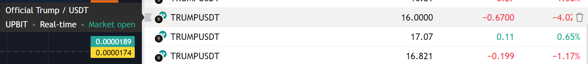

# Crypto Arbitrage FastAPI Application

This application is a FastAPI-based service designed to manage users and their selected cryptocurrency pairs for arbitrage opportunities. It includes a Telegram bot for user interaction and real-time monitoring of price differences across multiple exchanges.

## Project Motivation

This project was inspired by the observation of price discrepancies for cryptocurrencies across different exchanges. These price differences create arbitrage opportunities - the ability to profit by simultaneously buying an asset on one exchange where the price is lower and selling it on another exchange where the price is higher.

Having more capital allows traders to:
- Take advantage of larger arbitrage opportunities
- Offset fixed costs like fees more effectively
- Generate meaningful returns even from smaller price differences
- Have more flexibility in position sizing

For example:
- Exchange A might list TRUMPUSDT at $16
- While Exchange B lists it at $17.07
- This $1.07 difference represents a 6.69% price gap. Trading with 5000 USDT could yield approximately 334.50 USDT in potential profit (before fees)

## Profit Potential Scales with Capital

The potential profit from arbitrage trading increases proportionally with the amount of capital deployed:

Example with TRUMPUSDT price difference of 6.69%:
- Trading with 5,000 USDT → ~334.50 USDT profit
- Trading with 10,000 USDT → ~669 USDT profit  
- Trading with 50,000 USDT → ~3,345 USDT profit
- Trading with 100,000 USDT → ~6,690 USDT profit

*Note: These are theoretical maximum profits before considering:
- Trading fees
- Transfer fees between exchanges
- Slippage
- Available liquidity
- Network congestion
- Other execution risks

The application helps users:
1. Monitor these price differences in real-time
2. Track multiple currency pairs across selected exchanges
3. Get notifications when significant arbitrage opportunities arise
4. Make more informed trading decisions

By automating the monitoring process and providing instant notifications through Telegram, traders can quickly identify and act on profitable arbitrage opportunities that might otherwise be missed through manual observation.

## Features

- **User Management**: Create, read, update, and delete user accounts.
- **Currency Pair Management**: Add, view, and remove cryptocurrency pairs.
- **User Currency Pair Selection**: Users can select currency pairs and specify exchanges to monitor.
- **Real-time Monitoring**: Check real-time prices and calculate arbitrage opportunities.
- **Telegram Bot Integration**: Interact with the application via a Telegram bot.

